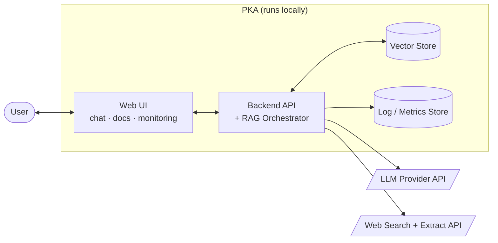
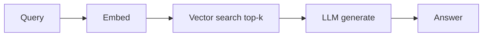
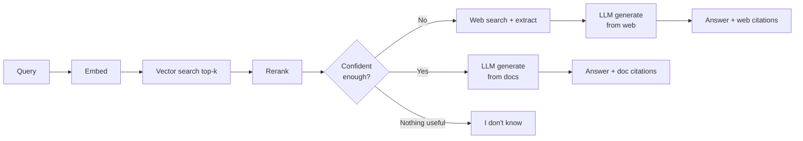
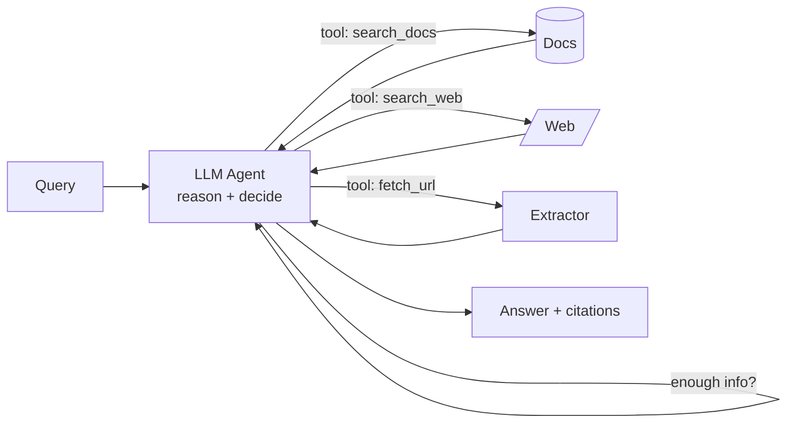
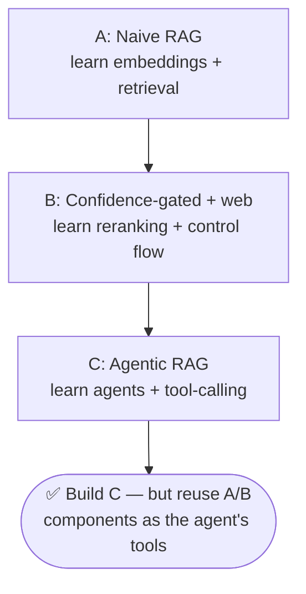
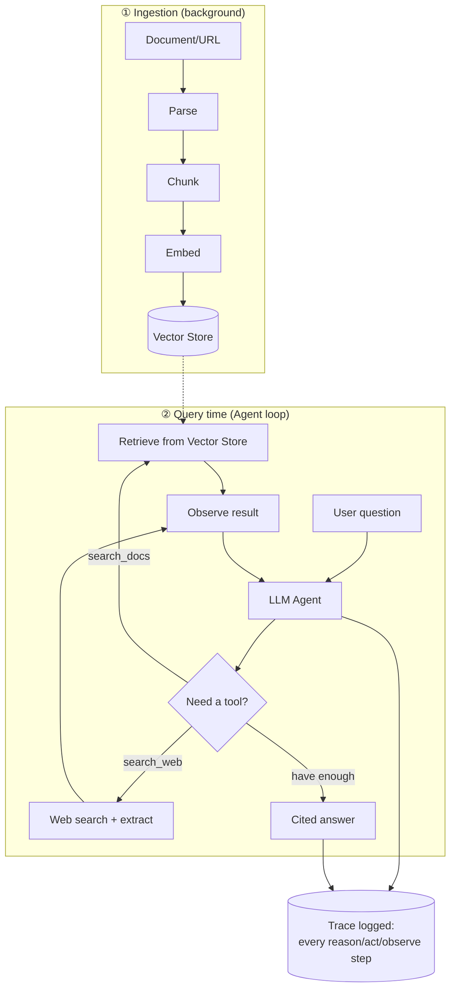

# Personal Knowledge Assistant (PKA) — High-Level Design (HLD)

**Status:** Draft v1.0
**Based on:** `docs/requirements/PRD.md`
**Purpose of this doc:** Explain *what* we are building, *how the pieces fit together*, and
*which approach to pick*. Because the goal of this project is to **learn AI concepts**, every
section ends with the concept it teaches.

---

## 1. What are we building? (in one breath)

A private chatbot that answers your questions using **your own documents first**, falls back to
**web search** when your docs can't answer, **cites its sources**, and **logs everything** so you
can see exactly why it answered the way it did.

The single most important AI concept here is **RAG (Retrieval-Augmented Generation)**:
> Instead of trusting the LLM's memory, we *retrieve* relevant text and *feed it into the prompt*,
> so the model answers from facts we control — and we can cite them.

---

## 2. System Context (zoom level 0)

**What leaves the machine:** only (a) LLM API calls and (b) explicit web searches. Documents and
logs stay local (PRD **NFR-1: privacy**).

---

## 3. Major Components

| Component | Responsibility | AI concept it teaches |
|---|---|---|
| **Ingestion Pipeline** | Parse → chunk → embed → store documents | Chunking, **embeddings**, vector indexing |
| **Retriever** | Turn a query into vectors, find top-k similar chunks | **Semantic search**, similarity (cosine) |
| **Reranker** *(optional)* | Re-score retrieved chunks for relevance | **Cross-encoder reranking** |
| **RAG Orchestrator** | Decide flow: retrieve → judge confidence → maybe web → generate | **Orchestration / control flow**, **confidence gating** |
| **Web Search Tool** | Search + extract web content when local is weak | **Tool use / function calling**, fallback |
| **LLM Client** | Build the grounded prompt, stream the answer | **Prompt construction**, **grounding**, streaming |
| **Citation Engine** | Map answer claims back to chunks/URLs | **Attribution / provenance** |
| **Observability** | Emit a structured trace for every step | **LLM observability / tracing**, eval signals |

---

## 4. The Core Question: Which RAG Approach?

This is the most important design decision, and it's a great place to learn. Here are three
approaches in increasing sophistication. **We are building Approach C (Agentic RAG)**, because the
goal of this project is to learn the agentic paradigm — an LLM that *decides and acts*, not just a
fixed pipeline. Approaches A and B are kept below as the conceptual ladder that leads up to C.

### Approach A — Naive RAG (retrieve → generate)

Always retrieve, stuff the chunks into the prompt, and answer. No confidence check, no web.

| Pros | Cons |
|---|---|
| Simplest to build & understand | Answers even when retrieval is garbage (hallucination risk) |
| Fewest moving parts, cheapest | No web fallback (fails PRD **G3**) |
| Great first milestone (PRD **M1**) | No "I don't know" path (fails **FR-6**) |
| Good for learning embeddings + vector search | Quality fully depends on raw vector similarity |

---

### Approach B — Confidence-Gated RAG with Web Fallback

Retrieve, **rerank**, then a **confidence gate** decides: answer from docs, fall back to web, or
honestly say "I don't know." This directly implements PRD **FR-2, FR-4, FR-6, G3**.

| Pros | Cons |
|---|---|
| Matches the PRD almost 1:1 | More components (rerank, confidence, web tool) |
| Reduces hallucination via grounding + gate | Must tune the confidence threshold |
| Teaches the *full* modern RAG stack | Web path adds latency & external cost |
| Transparent: every branch is loggable | Reranking adds a little latency |
| Predictable, deterministic control flow | Less "autonomous" than agentic approaches |

**Good stepping stone:** explicit, deterministic control flow — easy to trace and debug. It's the
mental model to understand *before* handing those same decisions to an agent in Approach C.

---

### Approach C — Agentic RAG (LLM picks the tools) ✅ **Chosen**

The LLM itself decides, via **function calling**, whether to search docs, search the web, fetch a
page, or answer directly — and it can **loop** (observe a tool's result, then decide the next
action) until it's confident. This is the **ReAct pattern**: *Reason → Act → Observe → repeat*.

| Pros | Cons | How we mitigate it |
|---|---|---|
| Most flexible; handles multi-step questions | Non-deterministic — harder to debug | One rich trace per run captures every reason/act/observe step (see LLD) |
| Teaches agents, tool-calling, ReAct loops | Higher cost & latency (multiple LLM calls) | Hard **max-iteration** cap + token budget + cheaper model for routing |
| Naturally handles mixed-source (PRD **UC-4**) | Can loop or call tools needlessly | Step limit + a "you must answer now" final-turn prompt |
| Closest to "frontier" assistant behavior | Tracing has variable step count | Trace schema stores an ordered list of steps, however many there are |

**Why this one:** it is the explicit learning goal. We accept the extra complexity because the
whole point is to understand agents, tool/function calling, and autonomous control loops. The
downsides are real but manageable with the guards above — and the observability features the PRD
already demands (full traces) are *exactly* what make an agent debuggable.

---

### Decision summary

> **Key insight:** Approach C doesn't throw away A and B — it *reuses* their pieces (embedding,
> retrieval, reranking, web search) and exposes them to the LLM as **tools**. The agent replaces
> the hard-coded `if confidence < threshold` gate with the model's own judgment.

---

## 5. Recommended Tech Stack (with trade-offs)

The PRD calls the stack a "proposal, not binding." Here are the choices and why.

| Layer | Recommendation | Alternatives | Why / trade-off |
|---|---|---|---|
| Frontend | React + TypeScript | Svelte, Vue | PRD already assumes it; huge ecosystem |
| Backend | Python + FastAPI | Node/Express | Best AI/ML library support (langchain, sentence-transformers) |
| Vector store | **Chroma** or **LanceDB** (embedded) | pgvector (Postgres) | Embedded = zero-ops & local-first (PRD privacy). pgvector if you already run Postgres |
| Embeddings | Hosted (OpenAI `text-embedding-3-small`) **or** local (`bge-small`) | many | Hosted = simplest; local = fully private but slower |
| LLM | Hosted (GPT/Claude) **or** local (Ollama) | — | **Must support tool/function calling** for the agent. Hosted = most reliable tool use; local models vary — verify the model supports tools |
| Reranker | `bge-reranker` (local, optional) | Cohere Rerank API | Local keeps data private |
| Web search | Tavily | Brave, Bing | Tavily returns clean extracted content (less plumbing) |
| Agent loop | Hand-rolled tool-calling loop | LangGraph, LlamaIndex agents | Hand-rolling first teaches *how agents actually work*; adopt a framework later if needed |
| Logs/metrics | SQLite | Postgres | SQLite = single-file, local, zero-ops |

**Privacy spectrum to learn from:** fully-local (Ollama + local embeddings + Chroma) vs
hosted-quality (OpenAI + Tavily). Build the interfaces so either can be swapped — this teaches
**provider abstraction**.

---

## 6. End-to-End Data Flow (happy path)

Two pipelines: **ingestion** (offline, builds the index) and **query** (online — an **agent loop**
that calls tools until it can answer). Every agent step (reason → act → observe) emits an event
into one **trace** (PRD **FR-14, NFR-4**).

---

## 7. Cross-Cutting Concerns

- **Observability (a headline feature, not an afterthought):** every request produces exactly one
  trace with per-step timing, tokens, and cost. This is the modern practice of **LLM observability** —
  you can't improve what you can't see.
- **Privacy:** local-first storage; explicit, labeled egress only.
- **Cost control:** enforce `top-k` limits and token budgeting; record cost per call (**NFR-5**).
- **Graceful degradation:** ingestion failures are per-document and retryable (**NFR-3**); the
  answer path always has an "I don't know" exit.

---

## 8. AI Concepts You'll Learn (map)

| Concept | Where it lives | Why it matters |
|---|---|---|
| Embeddings | Ingestion + Retriever | Turns text into vectors so we can compare *meaning* |
| Chunking | Ingestion | Right-sized pieces → better retrieval & citations |
| Vector / semantic search | Retriever | Find relevant text without exact keyword match |
| Reranking | Reranker (a tool) | Fixes "similar but not relevant" results |
| **Agents & ReAct loop** | Agent Orchestrator | The LLM reasons, acts, observes, repeats — the core learning goal |
| **Tool / function calling** | Tool registry (search_docs, search_web, fetch_url) | Let the model *act*, not just talk |
| **Agent guardrails** | Max-iteration cap, token budget | Keep an autonomous loop cheap, fast, and safe |
| Grounding & citations | LLM client + Citation engine | Trustworthy, verifiable answers |
| Prompt construction | LLM client (system + tool schemas) | The "context window" is the real product |
| LLM observability / tracing | Observability | Debug a non-deterministic agent; measure quality & cost |

---

## 9. Next Step

See **`LLD.md`** for the detailed component design, the full data model, API surface, and
**sequence diagrams** for ingestion, querying, web fallback, and tracing.
