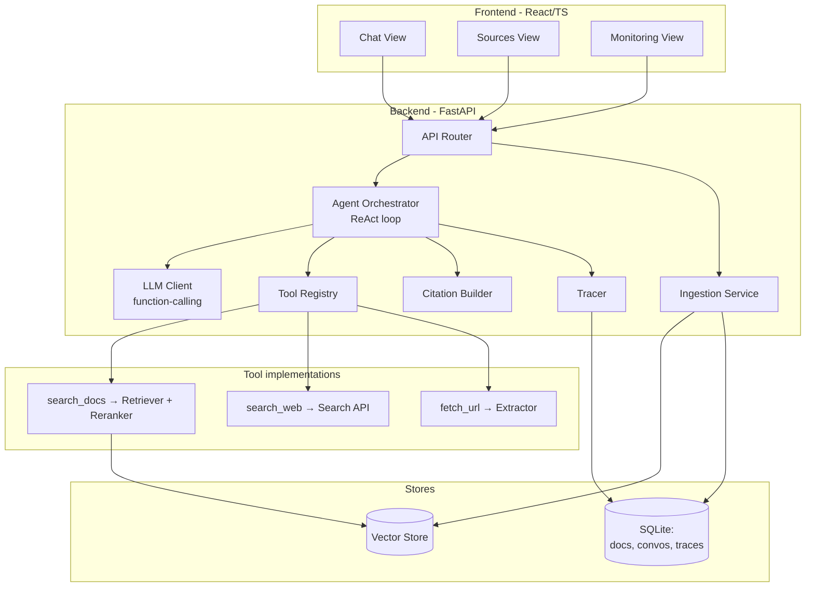
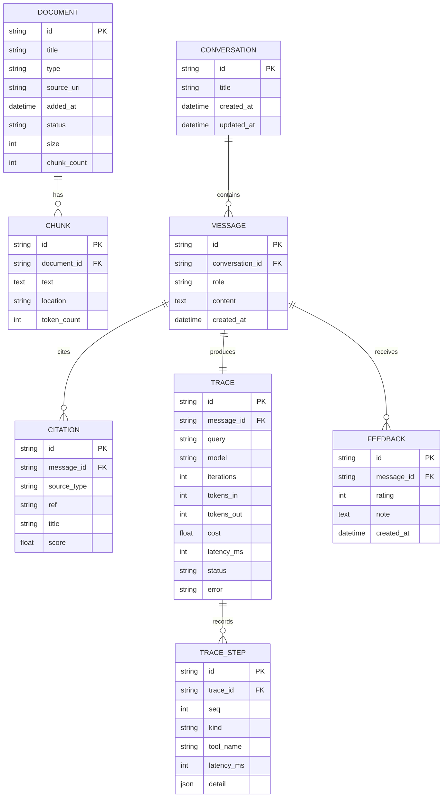
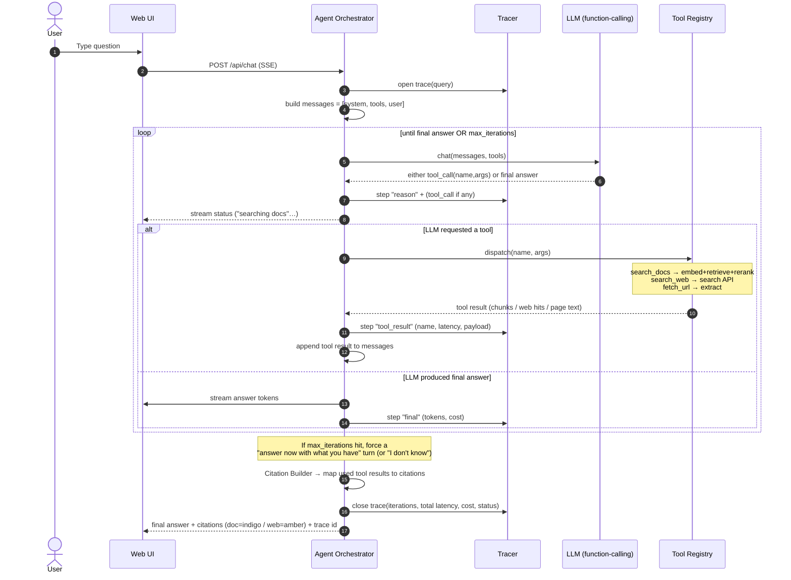
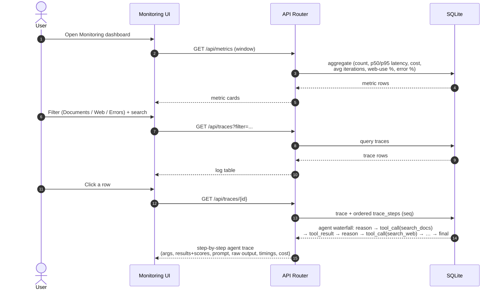
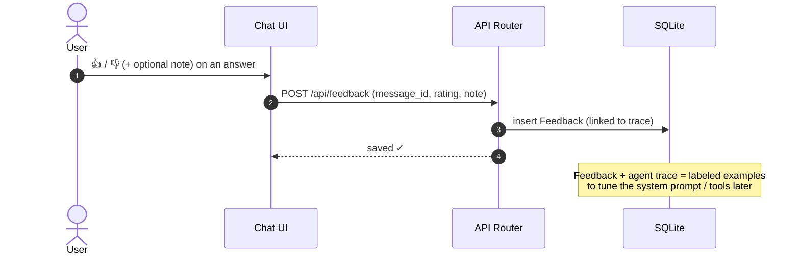
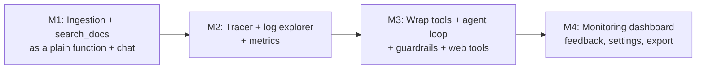

# Personal Knowledge Assistant (PKA) — Low-Level Design (LLD)

**Status:** Draft v1.1
**Based on:** `docs/requirements/PRD.md` and `docs/design/HLD.md`
**Implements:** **Approach C — Agentic RAG** (the LLM decides which tools to use, in a loop)
**Purpose:** The *how*. Concrete modules, data model, APIs, and **sequence diagrams** for every
important flow. Written to be readable while still teaching the AI concept behind each step.

---

## 1. The Big Idea: an Agent with Tools

Instead of a fixed pipeline, the LLM runs in a **loop** (the **ReAct pattern**):

```
Reason  → the model thinks about what it needs
Act     → it calls a tool (search_docs, search_web, fetch_url)
Observe → it reads the tool's result
… repeat until it has enough, then Answer (with citations)
```

The components from a classic RAG pipeline (retrieval, reranking, web search) still exist — but
now they are **tools** the agent can choose to call, rather than fixed stages. The agent's
"confidence gate" is the model's own judgment, bounded by **guardrails** (a max-iteration cap and
token budget) so the loop stays cheap and safe.

---

## 2. Module Breakdown



### Responsibilities (one line each)

| Module | Does | AI concept |
|---|---|---|
| **Agent Orchestrator** | runs the reason→act→observe loop, enforces guardrails, owns the trace | agents, ReAct, control loop |
| **Tool Registry** | declares tool schemas to the LLM; dispatches tool calls | tool / function calling |
| **`search_docs` tool** | embed query → top-k similarity → rerank → return chunks | semantic search, reranking |
| **`search_web` tool** | web search, return result list (title, url, snippet) | tool use / fallback |
| **`fetch_url` tool** | fetch + extract clean text from a URL | content extraction |
| **LLM Client** | function-calling chat, returns either a tool call or a final answer | prompt construction, grounding |
| **Ingestion Service** | parse → chunk → embed → upsert | embeddings, chunking |
| **Citation Builder** | turn the tool results the agent actually used into citations | attribution / provenance |
| **Tracer** | one trace per request with an **ordered list of agent steps** | LLM observability |

---

## 3. Data Model (concrete schema)

Maps PRD §9 into tables. SQLite for relational data; vectors live in the vector store keyed by
`chunk_id`. The agent's variable-length reasoning is captured by `TRACE_STEP` (one row per
reason/act/observe step), so a trace can have 3 steps or 13.



`TRACE.iterations` = how many loops the agent took. `TRACE_STEP.kind` ∈ {`reason`, `tool_call`,
`tool_result`, `final`}; `tool_name` records which tool (for `tool_call`/`tool_result` steps).
This is what makes a non-deterministic agent fully **inspectable** (PRD UC-7).

> The embedding vector is **not** stored in SQLite — it lives in the vector store
> (Chroma/LanceDB) indexed by `chunk_id`.

---

## 4. Tool Definitions (the agent's "API")

These schemas are sent to the LLM so it knows what it can call. This *is* function calling.

| Tool | Input | Returns | Notes |
|---|---|---|---|
| `search_docs` | `query: string`, `k?: int` | list of `{chunk_id, text, title, location, score}` | runs embed → vector search → rerank internally |
| `search_web` | `query: string` | list of `{title, url, snippet}` | gated by the global/per-message web toggle (FR-5) |
| `fetch_url` | `url: string` | `{url, title, text}` | clean extracted text for one page |

```jsonc
// Example schema advertised to the LLM for one tool
{
  "name": "search_docs",
  "description": "Search the user's private documents for relevant passages.",
  "parameters": {
    "type": "object",
    "properties": {
      "query": { "type": "string", "description": "What to look for" },
      "k":     { "type": "integer", "description": "How many passages", "default": 5 }
    },
    "required": ["query"]
  }
}
```

**Concept:** the agent never touches the database directly — it can only *request* actions through
typed tools. The backend validates and executes them. This is the safety boundary of agentic systems.

---

## 5. API Surface (REST + SSE for streaming)

| Method | Path | Purpose | PRD ref |
|---|---|---|---|
| `POST` | `/api/chat` (SSE stream) | Ask a question; streams agent steps + final answer + trace id | FR-1, FR-2 |
| `POST` | `/api/documents` | Upload file / add URL (async indexing) | FR-7 |
| `GET` | `/api/documents` | List sources + status | FR-8 |
| `POST` | `/api/documents/{id}/reindex` | Re-index a source | FR-9 |
| `DELETE` | `/api/documents/{id}` | Delete source + its chunks | FR-9 |
| `GET` | `/api/conversations` / `/{id}` | History | UC-5 |
| `GET` | `/api/traces` | Filterable log explorer | FR-15 |
| `GET` | `/api/traces/{id}` | Single trace waterfall (all agent steps) | UC-7 |
| `GET` | `/api/metrics` | Aggregate dashboard data | FR-16 |
| `POST` | `/api/feedback` | Thumbs up/down + note | FR-17 |
| `GET/PUT` | `/api/settings` | Model, top-k, max-iterations, token budget, web default | FR-19 |

> Over SSE we stream **agent step events** too (`reasoning`, `tool_call`, `tool_result`, `answer`),
> so the UI can show a live "thinking / searching docs / searching web…" status.

---

## 6. Sequence Diagram — Ingestion (UC-2)

Unchanged by the agentic decision: ingestion still builds the index the `search_docs` tool uses.
**Async** so the UI stays responsive (status pill: Queued → Parsing → Indexed/Failed).

```mermaid
sequenceDiagram
    autonumber
    actor U as User
    participant UI as Web UI
    participant API as API Router
    participant ING as Ingestion Service
    participant EMB as Embedding Model
    participant VDB as Vector Store
    participant DB as SQLite

    U->>UI: Upload PDF / paste URL
    UI->>API: POST /api/documents
    API->>DB: insert Document(status=Queued)
    API-->>UI: 202 Accepted (doc id)
    Note over API,ING: returns immediately; work continues in background

    ING->>DB: status = Parsing
    ING->>ING: Parse (PDF/MD/TXT/HTML) → raw text
    ING->>ING: Chunk text (e.g. 500 tokens, 50 overlap)
    loop for each chunk
        ING->>EMB: embed(chunk text)
        EMB-->>ING: vector[768]
        ING->>VDB: upsert(chunk_id, vector, metadata)
        ING->>DB: insert Chunk(text, location, tokens)
    end
    ING->>DB: status = Indexed, chunk_count = N
    UI->>API: GET /api/documents (poll)
    API-->>UI: status = Indexed ✅

    Note over ING: On error → status=Failed(reason),<br/>isolated per-document (NFR-3)
```

**Concepts:** *chunking* (overlap preserves context across boundaries), *embeddings*
(text → vector), *upsert* (idempotent write enables re-indexing & dedup per FR-10).

---

## 7. Sequence Diagram — Agentic Query Loop (UC-1, UC-3, UC-4) ⭐ core flow

The heart of the system. The agent loops: each turn the LLM either **calls a tool** or **emits the
final answer**. A guardrail caps the number of iterations.



### The system prompt (what makes it an agent)

```text
SYSTEM:
You are PKA. Answer the user's question.
- Prefer the user's private documents: call search_docs first.
- If the documents are insufficient AND web is enabled, call search_web,
  then fetch_url on the most promising results.
- You may call tools multiple times. When you have enough, answer.
- Answer ONLY from tool results. Cite every claim as [n] mapping to a source.
- If neither documents nor web give a confident answer, say "I don't know."
TOOLS: search_docs(query,k), search_web(query), fetch_url(url)
```

**Concepts:** *agents & ReAct* (reason→act→observe loop), *function calling* (the model returns a
structured tool request, not prose), *grounding* (answer only from tool outputs → trustworthy
citations), *guardrails* (max-iterations + token budget bound cost and stop runaway loops).

> **Mixed-source (UC-4)** falls out naturally: the agent can call `search_docs` *and* `search_web`
> in the same run, and the Citation Builder tags each citation with its origin.

---

## 8. Sequence Diagram — Inspect a Trace (UC-6, UC-7)

Observability matters even more for an agent because the path varies. One query = one complete,
inspectable trace showing every loop iteration.



**Concepts:** *LLM/agent observability* — the trace shows not just *what* the answer was but the
agent's whole decision path: which tools it chose, in what order, and why it stopped.

---

## 9. Sequence Diagram — Feedback Loop (UC-9)



---

## 10. Agent Guardrails — concrete logic

The loop is short but conceptually central. These bounds are what make an autonomous agent safe
and affordable, and they're all **settings** (FR-19) so you can experiment.

```text
MAX_ITERATIONS   = 6      # hard cap on reason→act cycles
TOKEN_BUDGET     = 12000  # across the whole run
WEB_ENABLED      = bool   # global + per-message toggle (FR-5)

for i in range(MAX_ITERATIONS):
    resp = llm.chat(messages, tools=enabled_tools(WEB_ENABLED))
    if resp.is_final or tokens_used > TOKEN_BUDGET:
        break
    result = registry.dispatch(resp.tool_call)   # validated + executed
    messages.append(result)

if not resp.is_final:                            # ran out of budget/iterations
    resp = llm.chat(messages + ["Answer now with what you have, or say you don't know."])
```

**Why these guardrails matter (the cons of Approach C, mitigated):**
- *Cost/latency* → `MAX_ITERATIONS` + `TOKEN_BUDGET` bound the worst case.
- *Looping needlessly* → the forced final turn guarantees termination.
- *Disabled web* → `enabled_tools()` simply hides `search_web`/`fetch_url` from the model.

**Concept:** giving an autonomous loop hard limits — the difference between a useful agent and a
runaway one.

---

## 11. Error Handling & Edge Cases

| Situation | Behavior | PRD ref |
|---|---|---|
| PDF won't parse | Document → `Failed(reason)`, others unaffected | NFR-3 |
| `search_docs` returns nothing | Tool returns empty; agent decides to try web or abstain | FR-6 |
| LLM requests an unknown/invalid tool | Registry returns a typed error; agent re-plans | — |
| Max iterations reached | Forced final-answer turn (or "I don't know") | FR-6 |
| LLM API error / timeout | Trace `status=error`; UI shows friendly retry | NFR-4 |
| Web disabled but agent wants it | Tool hidden from schema; not callable | FR-5 |
| Re-adding same source | Dedup via content hash; upsert not duplicate | FR-10 |
| Cost/token budget exceeded | Loop stops, agent answers with what it has | NFR-5 |

---

## 12. Build Order (maps to PRD milestones)

Build the *pieces* first (as plain functions), then wrap them as tools and add the agent loop last.



This order means you always have a working system: first a simple retrieve-then-answer call, and
only once retrieval + tracing work do you hand the decisions to the agent in M3.

---

## 13. Summary

- The system is an **agent**: the LLM reasons and calls **tools** (`search_docs`, `search_web`,
  `fetch_url`) in a **ReAct loop**, bounded by guardrails.
- Classic RAG components aren't gone — they're the *implementations behind the tools*.
- Two pipelines remain: **ingestion** (offline) and **query** (online agent loop); one rich
  **trace** per request — now with an ordered list of agent steps — keeps the non-deterministic
  agent fully inspectable.
- Every provider (embeddings, LLM, web, vector store) is a swappable interface, so you can explore
  the **local ↔ hosted / private ↔ powerful** spectrum while learning how agents actually work.
