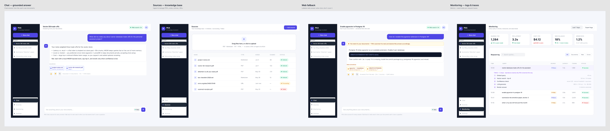
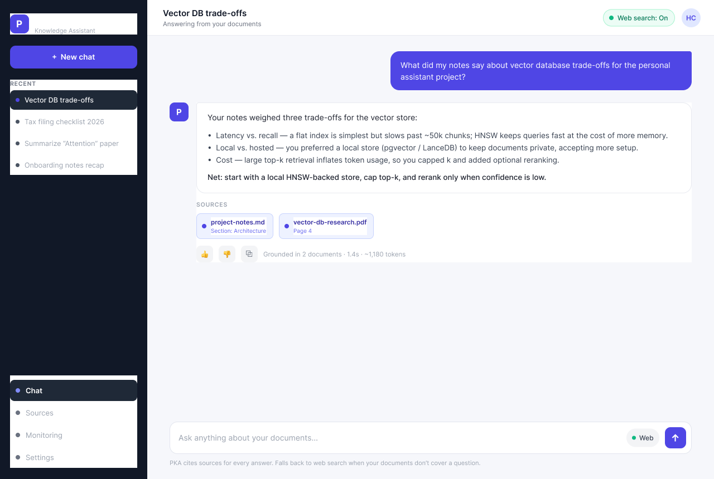
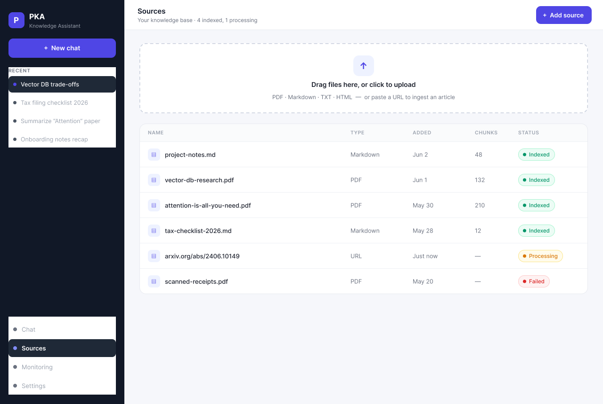
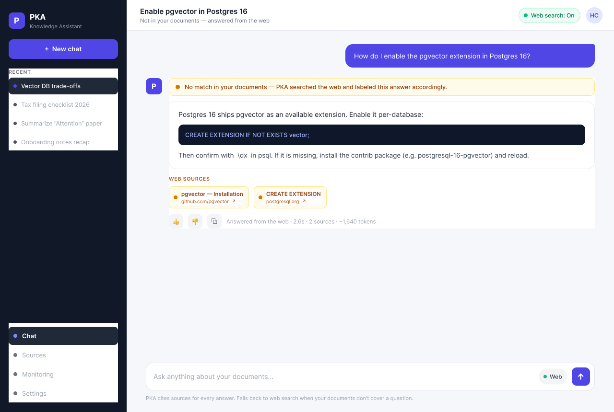
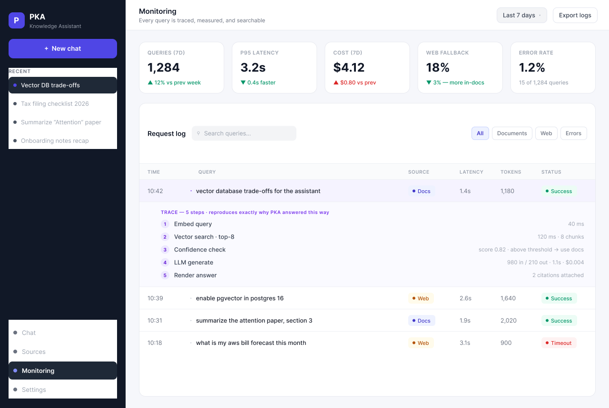

# Personal Knowledge Assistant (PKA) — Product Requirements Document

**Status:** Draft v1.0
**Owner:** Hirak Chatterjee
**Last updated:** 2026-06-07

---

## 1. Summary

The Personal Knowledge Assistant (PKA) is a private, single-user chatbot that answers
questions grounded in the user's own documents (notes, PDFs, articles, web clippings).
When the local knowledge base cannot confidently answer a question, PKA transparently
falls back to web search and cites its sources. Every interaction — queries, retrieved
chunks, tool calls, model responses, latencies, and costs — is logged so the owner can
monitor, audit, and improve the system over time.

**One-liner:** *Your documents, searchable and conversational — with web fallback and full
observability.*

---

## 2. Problem & Motivation

Knowledge workers accumulate notes, PDFs, and saved articles across many tools. This
information is hard to search, easy to forget, and impossible to "ask questions of" in a
natural way. Existing chatbots either:

- Don't know about your private documents, or
- Require uploading everything to an opaque third party with no audit trail, or
- Hallucinate confidently without citing where an answer came from.

PKA solves this for a single power-user who wants a **trustworthy, grounded, observable**
assistant over their personal corpus.

---

## 3. Goals & Non-Goals

### 3.1 Goals
- **G1.** Answer questions grounded in the user's documents with inline citations.
- **G2.** Ingest common formats (Markdown/notes, PDF, plain text, HTML articles, URLs).
- **G3.** Fall back to web search when local confidence is low, clearly labeling web-sourced answers.
- **G4.** Log every interaction end-to-end for monitoring, debugging, and quality review.
- **G5.** Provide a monitoring dashboard surfacing usage, latency, cost, and answer quality signals.
- **G6.** Keep data local/private by default; the user controls what leaves their machine.

### 3.2 Non-Goals (v1)
- Multi-user / team collaboration, sharing, or RBAC.
- Mobile native apps (responsive web only).
- Real-time document collaboration or editing inside PKA.
- Fine-tuning custom models (we use retrieval + off-the-shelf LLMs).
- Voice interface.

---

## 4. Target User & Personas

**Primary persona — "The Power Researcher" (single user):**
A technical professional with hundreds of notes/PDFs/articles who wants fast, cited
answers and trusts a system more when they can see *why* it answered the way it did.

| Attribute | Detail |
|---|---|
| Technical comfort | High — comfortable running a local app, managing API keys |
| Corpus size | 100s–1000s of documents |
| Top need | Accurate, cited answers from *their* material |
| Pet peeve | Confident hallucinations, opaque black boxes |
| Success feeling | "I can trust this and see exactly where the answer came from." |

---

## 5. Use Cases

Each use case lists the trigger, flow, and acceptance criteria.

### UC-1 — Ask a question answered from my documents
- **Trigger:** User types a question in the chat.
- **Flow:** PKA embeds the query → retrieves top-k chunks from the vector store →
  generates an answer grounded in those chunks → renders the answer with inline citations
  linking back to source documents/pages.
- **Acceptance:**
  - Answer includes ≥1 citation when local context is used.
  - Clicking a citation opens the source chunk/document preview.
  - If no relevant chunks are found, PKA says so rather than fabricating.

### UC-2 — Ingest a new document
- **Trigger:** User uploads a file (PDF/MD/TXT/HTML) or pastes a URL.
- **Flow:** Document is parsed → chunked → embedded → stored with metadata
  (title, source, added date, type). Progress is shown; status becomes "Indexed."
- **Acceptance:**
  - Supported formats: `.pdf`, `.md`, `.txt`, `.html`, and web URLs.
  - User sees per-document status: Queued → Parsing → Indexed → Failed (with reason).
  - Newly indexed content is queryable within seconds of completion.

### UC-3 — Web fallback when the answer isn't in my docs
- **Trigger:** Retrieval confidence is below threshold OR user explicitly enables "Search web."
- **Flow:** PKA performs a web search → fetches/extracts top results → answers using web
  content → labels the answer as **Web** and lists external source links.
- **Acceptance:**
  - Web-sourced answers are visually distinct from document-sourced answers.
  - External citations show domain + title + link.
  - User can toggle web fallback on/off globally and per-message.

### UC-4 — Mixed-source answer
- **Trigger:** A question is partially covered by documents and partially by the web.
- **Flow:** PKA combines local chunks + web results, attributing each claim to its origin.
- **Acceptance:** Citations clearly indicate which parts came from Documents vs Web.

### UC-5 — Review conversation history
- **Trigger:** User opens a past conversation from the sidebar.
- **Flow:** Full thread is restored, including citations and which sources/tools were used.
- **Acceptance:** Conversations persist across sessions and are searchable by keyword.

### UC-6 — Monitor the system (logs & metrics)
- **Trigger:** User opens the Monitoring dashboard.
- **Flow:** Dashboard shows volume, latency, cost, web-fallback rate, error rate, and a
  searchable log explorer where each row expands into a full request trace.
- **Acceptance:**
  - Every query produces exactly one log entry with a trace of all steps.
  - Logs are filterable by date, source type (doc/web), status, and latency.
  - A single trace shows: query → retrieval → tool calls → model call(s) → response, with timings + token/cost.

### UC-7 — Inspect a single request trace
- **Trigger:** User clicks a log row.
- **Flow:** Expands to a step-by-step waterfall: retrieved chunks (with scores), web calls,
  prompt sent to the model, raw model output, and final rendered answer.
- **Acceptance:** User can reproduce/understand *exactly* why PKA answered as it did.

### UC-8 — Manage the knowledge base
- **Trigger:** User opens the Documents/Sources view.
- **Flow:** List all sources with metadata; re-index, delete, or preview a document.
- **Acceptance:** Deleting a source removes its chunks from retrieval immediately.

### UC-9 — Give feedback to improve quality
- **Trigger:** User clicks thumbs up/down on an answer.
- **Flow:** Feedback is logged against the trace for later quality review.
- **Acceptance:** Feedback is visible in Monitoring and tied to the originating trace.

---

## 6. Functional Requirements

### 6.1 Chat & Retrieval
- **FR-1** Conversational UI with streaming responses.
- **FR-2** RAG pipeline: embed query → vector search (top-k, configurable) → rerank (optional) → generate.
- **FR-3** Inline citations resolving to source document + location (page/section/chunk).
- **FR-4** Confidence signal driving the web-fallback decision (threshold configurable).
- **FR-5** Per-message and global toggle for web search.
- **FR-6** Graceful "I don't know" when neither documents nor web yield a confident answer.

### 6.2 Ingestion
- **FR-7** Upload files and add URLs; background parsing + chunking + embedding.
- **FR-8** Metadata captured per source: title, type, source path/URL, added date, size, status, chunk count.
- **FR-9** Re-index and delete operations.
- **FR-10** Deduplication on re-adding the same source.

### 6.3 Web Search
- **FR-11** Pluggable web search provider (search API + content extraction).
- **FR-12** Results cached briefly to avoid duplicate fetches within a session.
- **FR-13** Clear visual labeling and external link citations.

### 6.4 Logging & Observability
- **FR-14** Structured log per request capturing: timestamp, conversation id, query, retrieved
  chunk ids + scores, tools used (retrieval/web), model name, prompt + completion tokens,
  cost estimate, total + per-step latency, status, and error (if any).
- **FR-15** Log explorer with filtering, search, and single-trace drill-down.
- **FR-16** Aggregate metrics: queries/day, p50/p95 latency, total + per-day cost,
  web-fallback rate, error rate, doc-vs-web answer split.
- **FR-17** Feedback (thumbs up/down + optional note) tied to traces.
- **FR-18** Export logs (CSV/JSON).

### 6.5 Settings
- **FR-19** Configure model, embedding model, top-k, confidence threshold, web fallback default.
- **FR-20** Manage API keys (LLM provider, web search provider) stored locally.

---

## 7. Non-Functional Requirements
- **NFR-1 Privacy:** Documents and logs stored locally by default; nothing leaves the
  machine except (a) LLM API calls and (b) explicit web searches.
- **NFR-2 Performance:** First token < 2s p50 for document answers on a typical corpus; full answer < 8s p95.
- **NFR-3 Reliability:** Ingestion failures are isolated per-document and retryable.
- **NFR-4 Transparency:** No answer is shown without an attached, inspectable trace.
- **NFR-5 Cost visibility:** Every model call's token usage and estimated cost is recorded.
- **NFR-6 Accessibility:** WCAG AA color contrast, full keyboard navigation.

---

## 8. System Architecture (high level)

```
┌──────────────┐     ┌──────────────────────────────────────────────┐
│   Web UI     │◄───►│                 Backend API                    │
│ (chat, docs, │     │  ┌─────────────┐  ┌──────────────┐            │
│  monitoring) │     │  │ Orchestrator │─►│  Retriever    │─► Vector  │
└──────────────┘     │  │  (RAG flow)  │  │ (embeddings)  │   Store   │
                     │  │              │  ├──────────────┤            │
                     │  │              │─►│ Web Search    │─► Web      │
                     │  │              │  │ + Extraction  │   Provider │
                     │  │              │─►│ LLM Provider  │─► LLM API  │
                     │  └──────┬───────┘  └──────────────┘            │
                     │         │ emits structured events              │
                     │         ▼                                       │
                     │   ┌─────────────┐                              │
                     │   │  Log Store   │──► Monitoring / Metrics      │
                     │   └─────────────┘                              │
                     └──────────────────────────────────────────────┘
                              ▲
                       ┌──────┴───────┐
                       │ Ingestion    │  parse → chunk → embed → store
                       │ Pipeline     │
                       └──────────────┘
```

**Suggested stack (proposal, not binding):** React + TypeScript frontend; Python (FastAPI)
or Node backend; a vector store (e.g., local pgvector / Chroma / LanceDB); an LLM provider
API; a web search + extraction provider; structured logs in a local SQLite/Postgres table.

---

## 9. Data Model (core entities)

| Entity | Key fields |
|---|---|
| **Document** | id, title, type, source_uri, added_at, status, size, chunk_count |
| **Chunk** | id, document_id, text, embedding, location (page/section), token_count |
| **Conversation** | id, title, created_at, updated_at |
| **Message** | id, conversation_id, role, content, citations[], created_at |
| **Trace (log)** | id, conversation_id, message_id, query, steps[], model, tokens_in/out, cost, latency_ms, status, error |
| **Citation** | id, message_id, source_type (doc/web), ref (chunk_id or url), title, score |
| **Feedback** | id, message_id/trace_id, rating, note, created_at |

---

## 10. Key Metrics (success criteria)
- **Groundedness:** ≥ 90% of document-sourced answers include a valid, resolvable citation.
- **Trust:** ≥ 80% of answers rated thumbs-up over a 2-week usage window.
- **Latency:** p50 first-token < 2s, p95 full answer < 8s.
- **Observability:** 100% of queries produce a complete, inspectable trace.
- **Web fallback precision:** Web fallback triggers only when local retrieval is genuinely insufficient (qualitative review via logs).

---

## 11. Screens (UI scope)
The Figma mocks cover four primary screens, each mapped to the use cases above:

| Screen | Covers use cases |
|---|---|
| **Chat — grounded answer** | UC-1, UC-4, UC-5, UC-9 |
| **Sources / Documents** | UC-2, UC-8 |
| **Web fallback state** | UC-3, UC-4 |
| **Monitoring dashboard** | UC-6, UC-7, UC-9 |



---

## 12. Milestones (suggested)
- **M1 — Core RAG:** ingestion (PDF/MD/TXT) + chat with citations.
- **M2 — Observability:** structured logging + log explorer + basic metrics.
- **M3 — Web fallback:** confidence-gated web search + labeled answers.
- **M4 — Polish:** monitoring dashboard, feedback loop, settings, exports.

---

## 13. Risks & Open Questions
**Risks**
- Hallucination despite retrieval → mitigate with strict grounding + "I don't know" path.
- PDF parsing quality varies → need robust parser + per-doc failure visibility.
- Cost creep from large contexts → enforce top-k + token budgeting + cost dashboard.

**Open questions**
1. Preferred LLM + embedding providers (local vs hosted)?
2. Preferred web search provider (e.g., Tavily/Brave/Bing)?
3. Single-machine desktop app vs locally-hosted web app?
4. Retention policy for logs (keep forever vs rolling window)?

---

## 14. Design / Figma Mocks

**Figma file:** [PKA — Personal Knowledge Assistant (UI Mocks)](https://www.figma.com/design/gjIMhcZ2Xp0RLzNw1uocVs)

All four mocks share a single design language: a dark navigation rail, an indigo
primary, document citations in indigo, and web sources in amber so source provenance
is always visually obvious.

### 14.1 Chat — grounded answer (UC-1, UC-4, UC-5, UC-9)
The core conversation. The assistant answer carries inline **SOURCES** chips that resolve
to the originating document and location, a per-answer feedback row (👍/👎/copy), and a
footer showing groundedness, latency, and token count. The composer has a per-message web
toggle; the header shows the global web-search state.

[Open frame in Figma →](https://www.figma.com/design/gjIMhcZ2Xp0RLzNw1uocVs?node-id=1-2)



### 14.2 Sources / Documents (UC-2, UC-8)
Knowledge-base management. A drag-and-drop dropzone accepts PDF / Markdown / TXT / HTML or
a pasted URL. The table shows each source's type, added date, chunk count, and a status pill
— **Indexed** (green), **Processing** (amber), **Failed** (red) — satisfying the per-document
status requirement (FR-8) and the failure-visibility requirement (NFR-3).

[Open frame in Figma →](https://www.figma.com/design/gjIMhcZ2Xp0RLzNw1uocVs?node-id=4-2)



### 14.3 Web fallback (UC-3, UC-4)
When local retrieval is insufficient, an amber notice banner makes the fallback explicit
("No match in your documents — PKA searched the web"). The answer is clearly distinguished
from document answers, and citations appear under a **WEB SOURCES** label with external
domains and outbound-link affordances.

[Open frame in Figma →](https://www.figma.com/design/gjIMhcZ2Xp0RLzNw1uocVs?node-id=6-2)



### 14.4 Monitoring — logs & traces (UC-6, UC-7, UC-9)
The observability surface. Metric cards summarize volume, p95 latency, cost, web-fallback
rate, and error rate over the selected window. The request log is filterable (All / Documents
/ Web / Errors) and searchable; expanding a row reveals the full step-by-step **trace**
(embed → vector search → confidence check → LLM generate → render) with per-step latency and
cost — directly realizing FR-14 through FR-16 and NFR-4 ("no answer without an inspectable
trace").

[Open frame in Figma →](https://www.figma.com/design/gjIMhcZ2Xp0RLzNw1uocVs?node-id=8-2)


